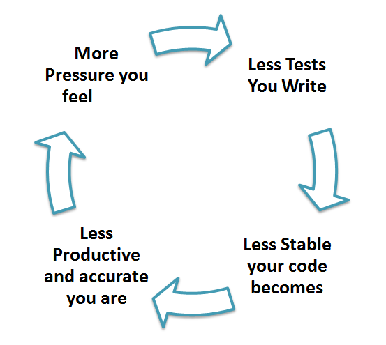

|                    |                                  |
| :----------------- | :------------------------------- |
| **Objectives**     | Increase code quality by example |
| **Teacher**        | Luca Tricerri                    |
| **Duration**       | 3 sessions each of 1 hour        |
| **Prerequisites**  | basic C++11 or Java              |
| **Class Max Size** | 10                               |

# 1. Description
Increase code quality using unit test via gtest and gmock.

## 1.1. Main Topics
- Unit test introduction
- How to unit test with gtest
- What is moking?
- How to mock with gmock

## 1.2. When
End of January, if possible in presence.

## 1.3. Prerequisite
- Github account (https://github.com/)
- Gitpod account (https://www.gitpod.io/)
- Fork this repository 
- To open the forked repo on Gitpod use the following button.

[](https://gitpod.io/#https://github.com/icub-tech-iit/training-programming-best-practices)


[](https://gitpod.io/from-referrer/)


- [What is Gitpod?](https://www.gitpod.io/docs/getting-started)

Optional
- Installed Gitpod Extension for Chrome
(https://chrome.google.com/webstore/detail/gitpod-always-ready-to-co/dodmmooeoklaejobgleioelladacbeki)
- Authorized Access

# 2. WHY UNIT TEST
:question: So how can I test my software? `There are several ways to do that`.  

UNIT TESTING is a type of software testing where individual units or components of the software are tested. The purpose is to validate that each unit of the software code performs as expected. Unit Testing is done during the development (coding phase) of an application by the developers. Unit Tests isolate a section of code and verify its correctness. A unit may be an individual function, method, procedure, module, or object.


<p style="text-align: center;"><i> The so called tests pyramid</i></p>


:question: What are the advantages to write unit tests?  
## 2.1. Early debug
Unit tests help to fix bugs early in the development cycle and save costs.
In this stage the software is easier to debug:
- It is smaller.
- It is less interdependent to others parts.

___
:pushpin: **Marconi's approach to software testing.**  
Marconi was a large company that developed a particular mobile phone technology called TETRA. It was a kind of GSM / UMTS / 4G mobile phone network for police and military forces.
They had created a test group in Florence with about 20 telecommunications engineers, they had poor results.
The head of the test group decided to take 20 philosophy graduates instead of engineers. I was among the ones that developed the TETRA, I was there in that mess. In the beginning, the so-called monkey tests were an incredible success. Bug after bugs, but... as the testers were not technicians they report on the tests were almost impossible to reproduce. So in the end, the 20 philosophy graduates went back to their studies.   
**The system was too complex to be tested all together.**
___


## 2.2. Avoid regressions so you can refactor your code
When you have a suite of unit tests, you can run it iteratively to ensure that everything keeps working correctly every time you add new functionality or introduce changes. This helps **refactoring** a lot.


:question: What is refactoring?  
 Using an Agile methodology we continuously develop new and unplanned features from the beginning. In this context, the application architecture may become unstable. Periodic refactoring is important.

## 2.3. Document your code
Running, debugging, or even just reading tests can give a lot of information about how the original code works, so you can use them as implicit documentation.  
Note that in this way the code documentation is always updated (otherwise the code does not compile)


## 2.4. Unit testing improves code coverage 

Unit testing helps to improve code coverage.  
:question: What is test coverage?  
It is a technique to ensure that your tests are testing your code or how much of your code you exercised by running the test. Are there code parts not tested?

## 2.5. Unit Testing Myth
- It requires time, and I am always overscheduled
My code is rock solid! I do not need unit tests.
- Programmers think that Integration Testing will catch all errors and do not execute the unit test. Once units are integrated, very simple errors which could have been very easily found and fixed in unit tested take a very long time to be traced and fixed.

The truth is Unit testing increase the speed of development.



# 3. HOW TO UNIT TEST

## 3.1. Good practices for unit testing include
- Creating tests for all **publicly exposed** functions, including class constructors and operators.
- Covering all code paths and checking both trivial and **edge cases**, including those with incorrect input data (negative testing).
- Assuring that each test works independently and does not prevent other tests from execution.
- Organizing tests in a way that the order in which you run them does not affect the results.


## 3.2. A single test
A single unit test is a method that checks some specific functionality and has clear pass/fail criteria. The generalized structure of a single test looks like this:

Test (TestGroupName, TestName)   {
- setup block
- running the under-test functionality
- checking the results (assertions block)
}


## 3.3. Modularize your code
As code's testability depends on its design, unit tests facilitate breaking it into specialized easy-to-test pieces.
An easy way to do this is to use self-consistent classes.  
Another useful technique is the so-called **dependence injection**.
It is a technique in which an object receives other objects. The receiving object is called a client and the passed-in (`injected`) object is called a service.   


With no partcular tecnique:  
```c++
class MyClass
{
    private:
        Database mydatabase_;
    public:
        int getIntFromDatabase(const std::string& query)
        {
            ...
            mydatabase_.get(query);
            ...
        }
};
```  
With inheritance  
```c++
class MyClass: public Database
{
    public:
        int getIntFromDatabase(const std::string& query)
        {
            ...
            get(query);
            ...
        }
};
```

With dependency injection  
```c++
class MyClass
{
    private:
        Database& mydatabase_;
    public:
        MyClass(Database &mydatabase):mydatabase_(mydatabase)
        {}
        int getIntFromDatabase(const std::string& query)
        {
            ...
            mydatabase_.get(query);
            ...
        }
};
```


The use of the inheritance technique tightly couples parent class with child class. It is harder to reuse the code and write units.  
<h3>Best choice: dependency injection.</h3>


## 3.4. Reference for Unittest
- https://www.jetbrains.com/help/clion/unit-testing-tutorial.html#basics  
- https://www.guru99.com/unit-testing-guide.html  
- Test coverage: https://www.guru99.com/test-coverage-in-software-testing.html#1
- https://betterprogramming.pub/13-tips-for-writing-useful-unit-tests-ca20706b5368

# 4. GTEST
googletest is a testing framework developed by the Testing Technology team with Google’s specific requirements and constraints in mind. Whether you work on Linux, Windows, or a Mac.
- very well done
- very well supported
- cmake friend
- visual studio code friend
- cross-platform

## 4.1. The tests are simple

```c++
TEST(Multiplier, check_multiply_001)
{
    Multiplier mult;
    EXPECT_EQ(8/*expected*/, mult.invoke(4, 2)/*current*/);
}
```

**CODE**: See test:testMultiplier.cpp

## 4.2. Small important details


### 4.2.1. Expected and current order
This is only a note to remember to correctly order the expected and current value.
```c++
    EXPECT_EQ(8/*expected*/, mult.invoke(4, 2)/*current*/);
```
The unit test framework usually gives the error log based on this assumption.

```
./training-programming-best-practices/unittest-course-part/src/unittest/testMultiplier.cpp:21: Failure
Expected equality of these values:
  8
  mult.invoke(4, 2)
    Which is: 7
[  FAILED  ] Multiplier.Test_simple001 (0 ms)
```

### 4.2.2. Name

Choose good names for tests, see for reference:https://dev.to/canro91/unit-testing-best-practices-6-tips-for-better-names-524m.


- Choose a naming convention for your test names and stick to it.
- Every test name should tell the scenario under test and the expected result. Do not worry about long test names. But, do not name your tests: Test1, Test2, and so on.
- Describe in your test names what you are testing, in a language easy to understand even for non-programmers.

❌ Do not prefix your test names with "Test". If you're using a testing framework that does not need keywords in your test names, don't do that.  


___
:pushpin:   
By Joel:  
the infamous Hungarian naming convention:  
https://www.joelonsoftware.com/2005/05/11/making-wrong-code-look-wrong/

### 4.2.3. Test in code

Don't mix test code with production code (never):

```c++
class WinterAssistant {
  public:
    bool isTest_ = false;

    bool needWinterJacket() {
        Thermometer *thermometer;
        if( isTest_ )
        {
            thermometer = new FakeThermometer();
        } else 
        {
            thermometer = new Thermometer();
        }

        return thermometer->getTemperature() < 40;
  }
}
```
In this case, you can use easily the code injection technique.

### 4.2.4. Run Your Tests as Part of Every Automated Build

Just as you should be running your tests as you develop, they should also be an integral part of your continuous integration process. A failed test should mean that your build is broken.

## 4.3. Check macro
Other EXPECT and ASSERT macro exist:  
```c++
EXPECT_TRUE
EXPECT_FALSE
EXPECT_EQ  
EXPECT_NE
EXPECT_GT
...
ASSERT_TRUE
ASSERT_FALSE
ASSERT_EQ  
ASSERT_NE
ASSERT_GT
...
FAIL
```

See also:  
https://github.com/google/googletest/blob/main/docs/reference/assertions.md


## 4.4. Check fatal/non fatal macro
ASSERT vs EXPECT  
```c++
    EXPECT_EQ(8/*expected*/, mult.invoke(4, 2)/*current*/
    ASSERT_EQ(8/*expected*/, mult.invoke(4, 2)/*current*/
```
Assert abort the current test while Expect gives only the error but goes on.
Expect is preferred.

## 4.5. Fixtures
If you find yourself writing two or more tests that operate on similar data, you can use a test fixture. This allows you to reuse the same configuration of objects for several different tests.


**CODE**: See test:testMultiplierParamAndFixture.cpp

## 4.6. Test with parameters

**CODE**: See test:testMultiplierParamAndFixture.cpp

## 4.7. Test private members

For testing private members we can use one of the c++ `most hidden` features.
It is possible to change visibility over inherited members.

```c++
class Multiplier
{
    protected:
        virtual void internalInvoke();//To be tested
};


class TestMultiplier : public Multiplier
{
   public:
        using Multiplier::internalInvoke;
};
```

The only prerequisite is that the method should be `virtual`.

**CODE**: See test:testMultiplierInternal.cpp

## 4.8. Test exceptions
Also thrown exceptions can be tested.
```c++
EXPECT_THROW(mult.invoke(10, 2), std::invalid_argument);
```

**CODE**: See test:testMultiplier.cpp

## 4.9. Test death

If we expect that a function closes the program with an error that contains "must be true".

```c++
TEST(MyDeathTest, Exit) 
{
  MyClass myclass();
  EXPECT_DEATH( { myclass.foo(); }, "must be true");
}
```
Plain exits:

```c++
TEST(MyDeathTest, NormalExit) 
{
  EXPECT_EXIT(NormalExit(), testing::ExitedWithCode(0), "Success");
}
```

Exit due to a signal and an error that match "Sending myself unblockable signal"

```c++
TEST(MyDeathTest, KillProcess) 
{
  EXPECT_EXIT(KillProcess(), testing::KilledBySignal(SIGKILL),"Sending myself unblockable signal");
}
```

## 4.10. The main
Quite easy to write:
```c++
#include "gtest/gtest.h"

int main(int argc, char **argv) {
    ::testing::InitGoogleTest(&argc, argv);
     return RUN_ALL_TESTS();
}
```

For filtering the tests add:
```c++
   ::testing::GTEST_FLAG(filter) = "Test.Test_003";
```
or you can use wildcard:
```c++
   ::testing::GTEST_FLAG(filter) = "Test.T*";
```

## 4.11. Visual studio code
VC is perfectly integrated with gtest, install the test explorer extension see:  
https://marketplace.visualstudio.com/items?itemName=matepek.vscode-catch2-test-adapter

The test explorer:  


:heavy_check_mark:
It could be necessary to add in settings.json:
```
testMate.cpp.test.executables": "${workspaceFolder}/install/bin/unittest"
```
With your install path.

## 4.12. How to cmake

```cmake
include(FetchContent)
FetchContent_Declare(
  googletest
  URL https://github.com/google/googletest/archive/609281088cfefc76f9d0ce82e1ff6c30cc3591e5.zip
)
```

## 4.13. References for gtest
https://google.github.io/googletest/primer.html

# 5. Exercises


## 5.1. Injection

Change this code using the code injection technique.

```c++
class CanSenderScheduler {
  public:
#ifndef TEST    
    bool isTest_ = false;
#else
    bool isTest_ = true;
#endif

    bool sendData(const std::vector<unsigned char>  &data)
    {
        CanServer *server;
        if( isTest_ )
        {
            server = new FakeCanServer(12);
        } else 
        {
            server = new CanServer(12);
        }

        return server->send(data);
    }
};

class CanServer
{
    public:
        CanServer(unsigned int address);
        bool send(const std::vector<unsigned char>  &data);
}

```

## 5.2. The division class 
- Complete the division class im `divisionlib` (take a look at the Multiplier class)
- As input, the method invokes, can have only numbers > -30.
- Add the unit test for the class. Be careful with the edge cases.

The skeleton is in `testDivision.cpp`

# 6. Testing complex objects

To test your complex class without the connected/related classes, you could use a mocking framework.
Not always is possible to obtain the desired result, it depends mainly on how your code is written.
If you are using dependency injection, the testability of the code is much better since you can inject mocks as well.

## 6.1. MOCK
A mock object implements the same interface as a real object (so it can be used as one), but lets you specify at run time how it will be used and what it should do (which methods will be called? in which order? how many times? with what arguments? what will they return? etc...).


## 6.2. MOCK vs STUB

Mocking is a way to replace a dependency in a unit under test with a stand-in for that dependency. The stand-in allows the unit under test to be tested without invoking the real dependency. 

**Stub**: Stub is an object that holds predefined data and uses it to answer calls during tests. Such as an object that needs to grab some data from the database to respond to a method call.

**Mocks**: Mocks are objects that register calls they receive. In test assertion, we can verify on Mocks that all expected actions were performed. A mock is like a stub but, the test will also verify that the object under test calls the mock as expected. Part of the test is verifying that the mock was used correctly.  
Also, the mocks can be `programmed` to give certain result values or behaviours.

## 6.3. How to
We are using gmock which is the moking library for gtest.  

When using gMock,

- first, you use some simple macros to describe the interface you want to mock, and they will expand to the implementation of your mock class.
- next, you create some mock objects and specify their expectations and behaviour using an intuitive syntax.
- then you exercise code that uses the mock objects. gMock will catch any violation of the expectations as soon as it arises.  

## 6.4. Dependency injection.

Mocking needs dependency injection to work better.
[See above](#33-modularize-your-code)

## 6.5. Disclaimed
This part of the course will be done by examples.


## 6.6. Simple mock
First of all, you need to mock the class and method we do not want to test directly.
```c++
class ...
{
    ...
    MOCK_METHOD(double, getDataFromFile, (unsigned int), (const, override));  // note the parentesis
}
```
**CODE**: See test:testMultiplierFromFile.cpp

## 6.7. Simple tests

**CODE**: See test:testMultiplierFromFile.cpp

## 6.8. Test c std API
In this case, is necessary to write a class to overlap the c API.  
See file: InterfaceForCApi.h

**CODE**: See test:testMediaScanner.cpp

## 6.9. Reference for gmock
http://google.github.io/googletest/gmock_cook_book.html

# 7. Exercises              

## 7.1. Pwm
Mock and write unit tests for `pwmlib`. You can find the skeleton in `testPwm.cpp`.

# 8. GitPod
How to:
- Fork the [training repo](https://github.com/icub-tech-iit/training-programming-best-practices/blob/master/unittest-course-part/README.md)  

- Only for Visual Studio Code users. Install extension on Visual Studio Code. This step is not mandatory.  

- Enter GitPod with the button (the first time it will take 5minutes).  

- Create build folder, create makefile and compile
  ```bash
  cd /workspace/training-programming-best-practices/unittest-course-part
  mkdir build
  cmake -DCMAKE_INSTALL_PREFIX=/workspace/training-programming-best-practices/unittest-course-part/install ..
  make install
  ```

- Execute UT
```bash
cd /workspace/training-programming-best-practices/install/bin
./unittest
```
   