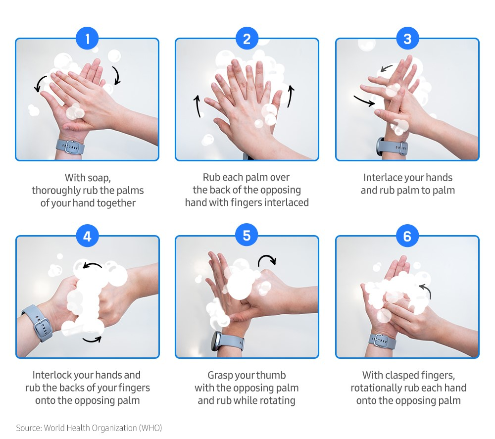
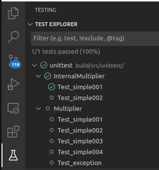

# 1. WHY UNITTEST
UNIT TESTING is a type of software testing where individual units or components of a software are tested. The purpose is to validate that each unit of the software code performs as expected. Unit Testing is done during the development (coding phase) of an application by the developers. Unit Tests isolate a section of code and verify its correctness. A unit may be an individual function, method, procedure, module, or object.


## 1.1. Early debug
Unit tests help to fix bugs early in the development cycle and save costs.

## 1.2. Avoid regressions so you can refactor your code
When you have a suite of unit tests, you can run it iteratively to ensure that everything keeps working correctly every time you add new functionality or introduce changes. This helps **refactoring** a lot.


## 1.3. Document your code
Running, debugging, or even just reading tests can give a lot of information about how the original code works, so you can use them as implicit documentation.  
Note that in this way the code documentation is always updated (otherway the code doesn't compile)


## 1.4. Unit testing improves code coverage 

Unit testing helps to improve code coverage.

## 1.5. Unit Testing Myth
- It requires time, and I am always overscheduled
My code is rock solid! I do not need unit tests.
- Programmers think that Integration Testing will catch all errors and do not execute the unit test. Once units are integrated, very simple errors which could have very easily found and fixed in unit tested take a very long time to be traced and fixed.

Truth is Unit testing increase the speed of development.


# 2. HOW TO UNITTEST

## 2.1. Good practices for unit testing include
- Creating tests for all **publicly exposed** functions, including class constructors and operators.
- Covering all code paths and checking both trivial and **edge cases**, including those with incorrect input data (negative testing).
- Assuring that each test works independently and does't prevent other tests from execution.
- Organizing tests in a way that the order in which you run them doesn't affect the results.



## 2.2. A single test
A single unit test is a method that checks some specific functionality and has clear pass/fail criteria. The generalized structure of a single test looks like this:

Test (TestGroupName, TestName)   {
- setup block
- running the under-test functionality
- checking the results (assertions block)
}


## 2.3. Modularize your code
As code's testability depends on its design, unit tests facilitate breaking it into specialized easy-to-test pieces.
An easy way to do this is to use self-consistent classes.  
Another usefull tecnique is the so called **dependance injection**.
It is a technique in which an object receives other objects. The receiving object is called a client and the passed-in ('injected') object is called a service. tests.   


With no partcular tecnique:  
```c++
class Test
{
    private:
        Database mydatabase_;
    public:
        int getIntFromDatabase(const std::string& query)
        {
            ...
            mydatabase_.get(query);
            ...
        }
};
```  
With inheritance  
```c++
class Test : public Database
{
    public:
        int getIntFromDatabase(const std::string& query)
        {
            ...
            get(query);
            ...
        }
};
```

With dependance injection  
```c++
class Test
{
    private:
        Database& mydatabase_;
    public:
        Test(Database &mydatabase):mydatabase_(mydatabase)
        {}
        int getIntFromDatabase(const std::string& query)
        {
            ...
            mydatabase_.get(query);
            ...
        }
};
```


The use of the inheritance tecnique tightly couples parent class with child class. It is harder to reuse the code and write unit.  
Best choice: **dependance injection**.


## 2.4. Reference for Unittest
https://www.jetbrains.com/help/clion/unit-testing-tutorial.html#basics  
https://www.guru99.com/unit-testing-guide.html

# 3. GTEST
googletest is a testing framework developed by the Testing Technology team with Google’s specific requirements and constraints in mind. Whether you work on Linux, Windows, or a Mac.

## 3.1. The tests are simple

```c++
TEST(Multiplier, Test_simple001)
{
	Multiplier mult;
	EXPECT_EQ(8/*expected*/, mult.invoke(4, 2)/*current*/);
}
```

## 3.2. Expected and current order
This is only a note to remember to correctly order the expected and current value.
```c++
	EXPECT_EQ(8/*expected*/, mult.invoke(4, 2)/*current*/
```
The unittest framework usually give the error log based on this assumption.

```
./training-programming-best-practices/unittest-course-part/src/unittest/testMultiplier.cpp:21: Failure
Expected equality of these values:
  5
  mult.invoke(1, 2)
    Which is: 2
[  FAILED  ] Multiplier.Test_simple001 (0 ms)
```

## 3.3. Check macro
Other EXPECT and ASSERT macro exist:  
```c++
EXPECT_EQ  
EXPECT_NE
EXPECT_GT
...
ASSERT_EQ  
ASSERT_NE
ASSERT_GT
...
```

See also:  
https://github.com/google/googletest/blob/main/docs/reference/assertions.md


## 3.4. Check fatal/non fatal macro
ASSERT vs EXPECT  
```c++
	EXPECT_EQ(8/*expected*/, mult.invoke(4, 2)/*current*/
    ASSERT_EQ(8/*expected*/, mult.invoke(4, 2)/*current*/
```
Assert abort the current test while Expect gives only the error but goes on.
Expect is preferred.

## 3.5. Fixtures
If you find yourself writing two or more tests that operate on similar data, you can use a test fixture. This allows you to reuse the same configuration of objects for several different tests.

## 3.6. Test private members

For testing private member we can use one of the c++ features.
It is possible to change visibility over inherited members.

```c++
class Multiplier
{
    protected:
        virtual void internalInvoke();//To be tested
};


class TestMultiplier : public Multiplier
{
   public:
	    using Multiplier::internalInvoke;
};
```

## 3.7. Test exceptions
Also thrown exceptions can be tested.
```c++
EXPECT_THROW(mult.invoke(10, 2), std::invalid_argument);
```

## 3.8. Test with parameters
Reference to test testMultiplier.cpp

## 3.9. Visual studio code
VC is perfectly integrated with gtest, install the test explorer extension see:  
https://marketplace.visualstudio.com/items?itemName=hbenl.vscode-test-explorer


The test explorer:  



## 3.10. How to cmake

```cmake
include(FetchContent)
FetchContent_Declare(
  googletest
  URL https://github.com/google/googletest/archive/609281088cfefc76f9d0ce82e1ff6c30cc3591e5.zip
)
```

## 3.11. References
https://google.github.io/googletest/primer.html

# 4. GMOCK

## 4.1. MOCK vs STUB

## 4.2. Mocking virtual method

## 4.3. Mocking Free Functions

## 4.4. inject dependances


## 4.5. Reference
http://google.github.io/googletest/gmock_cook_book.html


